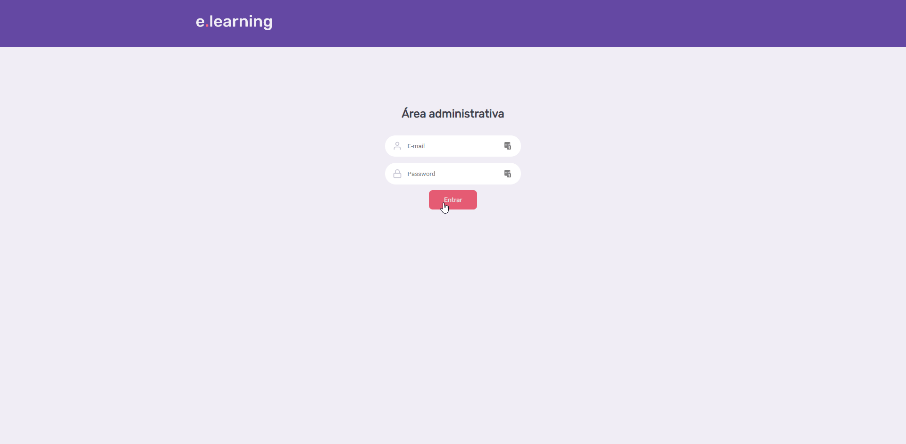

<h1 align="center">
    
</h1>

  <a href="#-projeto">Instalação</a>&nbsp;&nbsp;&nbsp;|&nbsp;&nbsp;&nbsp;
  <a href="#memo-licença">Licença</a>

 

  <h1>Frontend</h1>
  
  <h1>Frontend da parte administrativa</h1>
  

## Projeto

E.learning é uma plataforma em que estudantes possam assistir aulas de várias matérias, as quais se encontram classificadas.

- [Frontend](https://github.com/Jeronymoo/elearning-frontend): Página web em que o prestador de serviço pode acessar e visualizar os horários e datas de agendamento.
- [Admin-Frontend](https://github.com/Jeronymoo/elearning-admin-frontend): Aplicativo em que o cliente pode escolher o prestador de serviço e marcar seu horário na data de preferência.
- [Backend](https://github.com/Jeronymoo/elearning-backend): API REST responsável pelo CRUD da aplicação, disponibilizando os dados tanto para o aplicativo mobile, quanto para o front-end.

## Licença

Esse projeto está sob a licença MIT.
